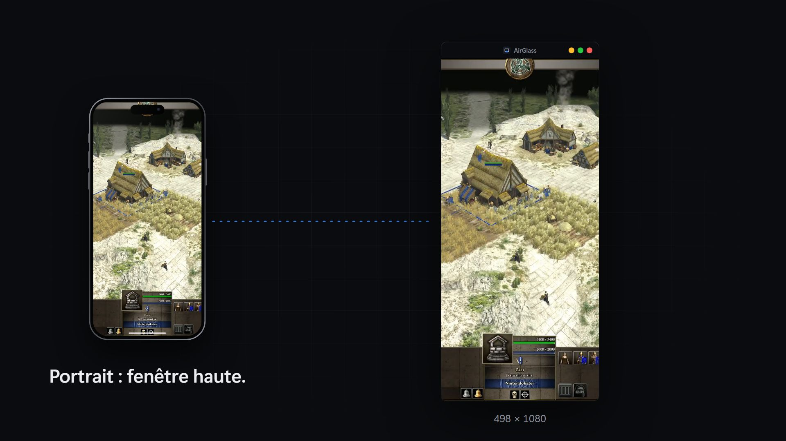
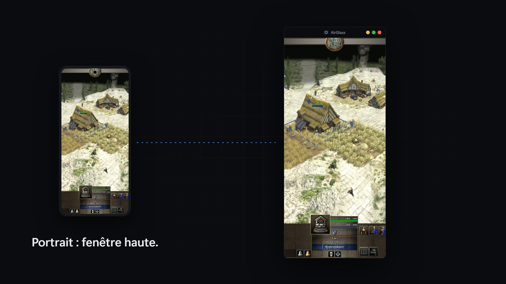

# AirGlass

Recopie l'écran d'un iPhone ou d'un téléphone Android sur Windows.

- **Apple** : AirPlay sans fil, via UxPlay. Centre de contrôle, puis « Recopie de l'écran ».
- **Android** : câble USB (ou Wi-Fi) avec le débogage USB activé, via scrcpy.

## Vidéos de présentation

Clique sur une image pour lire la vidéo.

## Utilisation

1. Lance AirGlass et choisis ton mode (le choix peut être mémorisé dans les réglages).
2. **Apple** : iPhone et PC sur le même réseau. Ouvre le Centre de contrôle, puis « Recopie de l'écran ».
3. **Android** : active le débogage USB, branche le câble, accepte l'autorisation sur le téléphone. La fenêtre scrcpy s'ouvre toute seule.

AirGlass ouvre des ports réseau (mDNS 5353, AirPlay 7000-7002). L'installeur s'exécute en administrateur pour autoriser le pare-feu.

## Prérequis pour développer

- Windows 64 bits
- .NET SDK 10 (`net10.0-windows`, WPF)
- Inno Setup 6 (pour l'installeur)
- Node.js (pour la vidéo promo)

## Build

Installeur complet (publish single-file self-contained, puis Inno Setup) :

~~~powershell
powershell -ExecutionPolicy Bypass -File scripts\build-release.ps1
~~~

Sortie : `Installer\Output\AirGlass-Setup-1.0.0.exe`.

Les binaires UxPlay et scrcpy sont attendus dans `external\uxplay-win` et `external\scrcpy-win`. Ils sont embarqués par l'installeur.

## Vidéos promo (Remotion)

~~~powershell
cd promo
npm install
npm start               # studio de prévisualisation
npm run build           # out\airglass-promo.mp4
npm run build:android   # out\airglass-android-promo.mp4
~~~

## Structure

| Dossier | Contenu |
|---|---|
| `Services/` | Lancement d'UxPlay et scrcpy, réseau, réglages, licence |
| `Installer/` | Script Inno Setup et visuels de l'assistant |
| `scripts/` | Build, génération d'icône et d'images d'installeur |
| `promo/` | Projet Remotion des vidéos de présentation |
| `tools/KeyGen/` | Générateur de clés de licence (usage vendeur uniquement) |
| `docs/videos/` | Vidéos de présentation rendues |

## Licences tierces

L'interface AirGlass est propriétaire. UxPlay (GPLv3), GStreamer, FFmpeg et scrcpy restent sous leurs licences respectives. Voir `THIRD-PARTY-NOTICES.txt`.

AirPlay, iPhone et iOS sont des marques d'Apple Inc. AirGlass n'est ni affilié, ni approuvé, ni sponsorisé par Apple.